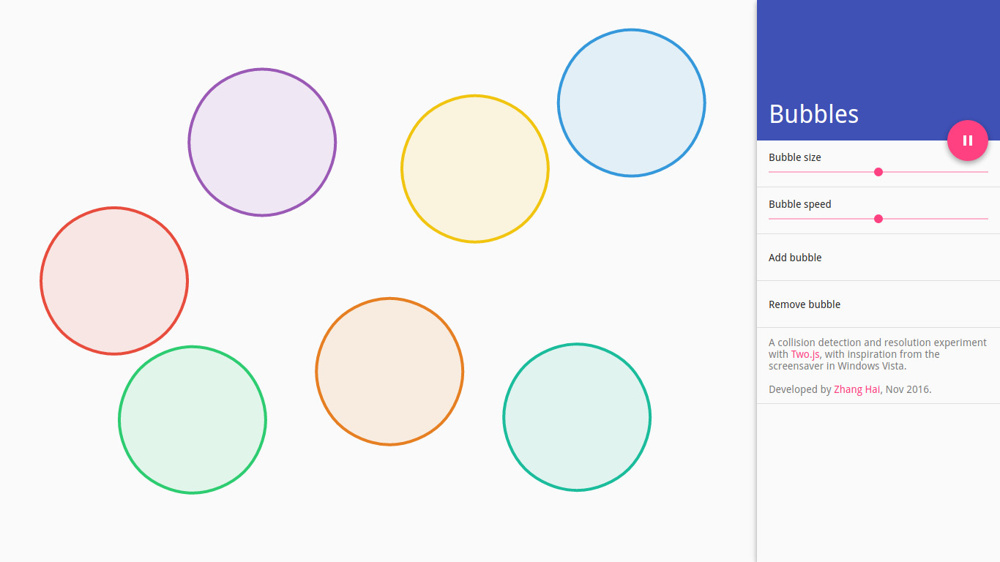

# Bubbles

https://dreamingincodezh.github.io/collision-detection-bubbles/

A collision detection and resolution experiment with [Two.js](https://two.js.org/), with inspiration from the screensaver in Windows Vista.

Developed by [Zhang Hai](http://www.zhanghai.me/), Jan 2017.
